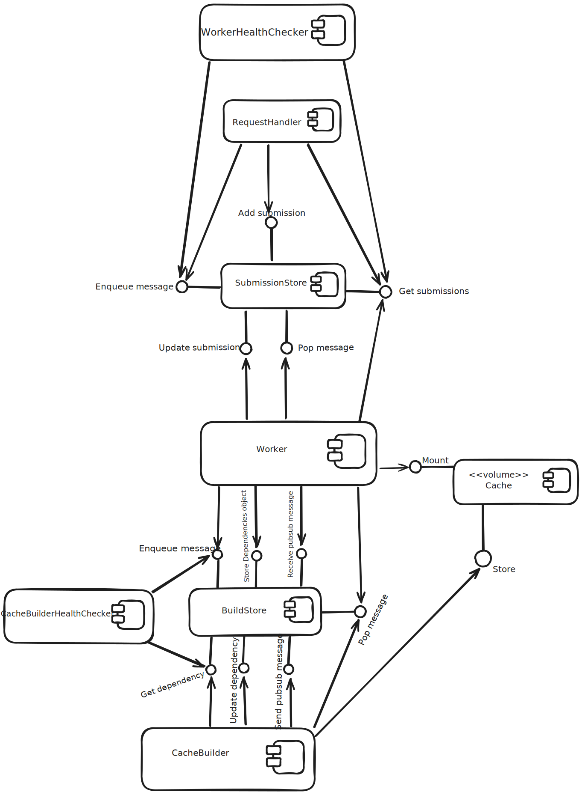

Component Diagram
#################

Diagram
*******

  |product-name|'s component diagram.

Components Responsibilities
***************************

RequestHandler
===============

Receiving requests from the client, massaging them into Submission objects, sending them to the SubmissionStore
and sending a message to the SubmissionStore to notify the Workers about the arrival of a new request.

SubmissionStore
================

Storing Submission objects that come from the RequestHandler, returning them when asked,
receiving messages from the RequestHandler and allowing the Workers to view the received message.

WorkerHealthChecker
===================

Checking the health of the Workers by checking a timestamp that the Workers constantly update on submissions.
If it is too old, the WorkerHealthChecker assumes the Worker has failed to process the submission
and sends a new message about the submission to the SubmissionStore.

.. _worker-component:

Worker
======
Fetching the submission from the SubmissionStore after receiving a notification about it,
sending messages to the BuildStore to request that the dependencies be installed in the cache
and processing the submission.

Cache
=====

Storing the dependencies as nix packages and being available for mount while processing submissions.

BuildStore
==========

Storing dependency objects that come from the Workers, returning them when asked,
receiving messages from the Workers and allowing the CacheBuilder to view the received message.

.. _cache-builder-component:

CacheBuilder
============

Fetching the dependencies object from the BuildStore after receiving a notification about it, installing the
dependencies in the cache and sending the corresponding result to the BuildStore.

CacheBuilderHealthChecker
=========================

Same as the WorkerHealthChecker but for build requests.
