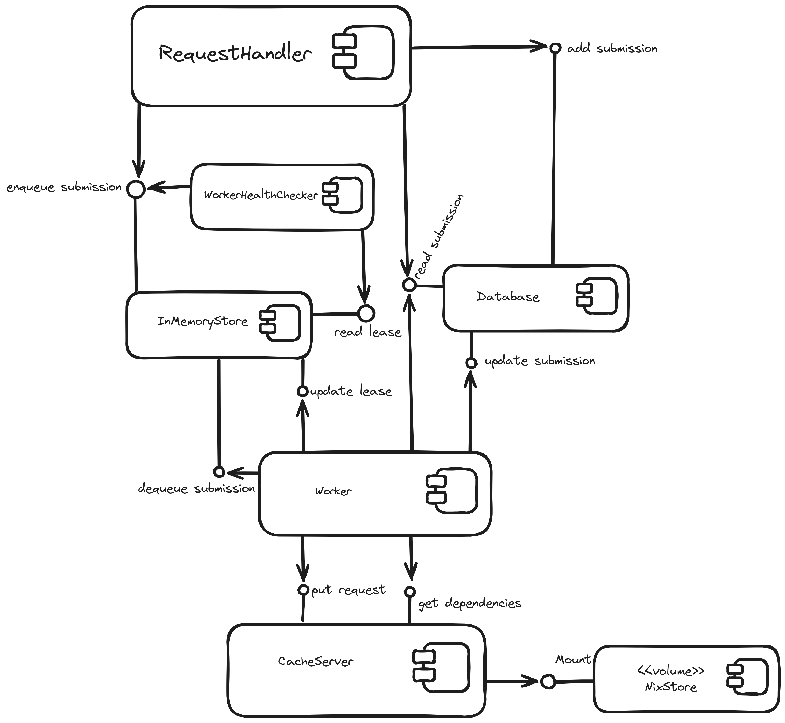

Component Diagram
#################

Diagram
*******

  |product-name|'s component diagram.

Components Responsibilities
***************************

RequestHandler
===============

Receiving requests from the client, massaging them into Submission objects, sending them to the Database
and enqueueing the submission id in the InMemoryStore to notify the Workers about the arrival of a new request.

Database
================

Storing Submission objects that come from the RequestHandler and allowing their retrieval/updating.

InMemoryStore
================

Allowing RequestHandlers to enqueue submission ids, allowing the Workers to dequeue them and allowing the Workers to
store and update the "lease" of submissions.

WorkerHealthChecker
===================

Checking the health of the Workers by checking a timestamp (lease) that the Workers constantly update in
the InMemoryStore.
If the lease is too old, the WorkerHealthChecker assumes the Worker has failed to process the submission
and enqueues the submission id in the InMemoryStore.

.. _worker-component:

Worker
======

Dequeuing submission ids from the InMemoryStore, fetching and updating the corresponding submissions from the Database,
installing dependencies if not in CacheServers, asking CacheServers to cache the dependencies,
and processing submissions.

.. _cache-server-component:

CacheServer
============

Caching and serving the dependencies for the Worker.

NixStore
========

Storage for CacheServer in which the dependencies are installed as nix packages.
