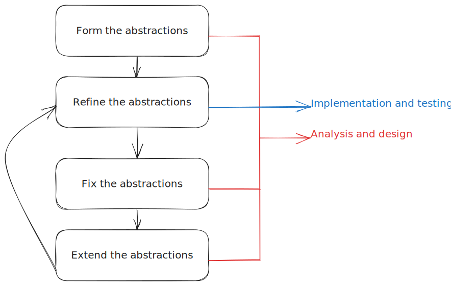

Development methodology
#######################

The nature of system specification
**********************************

System specification is an abstraction of how the system works (or should work).
System implementation is a refinement of such abstraction.
Abstracting the system in the form of specification documents helps developers focus on the core idea without getting
stuck in implementation details; however, such abstraction doesn't come without its risks.

Risks of abstraction
********************

The human brain can unintentionally fall into some pitfalls while thinking of abstractions:

Ambiguities
===========

#.  Developer states abstraction "a".
#.  Developer states abstraction "c" depending on abstraction "a" and an implicit abstraction "b".

The developer's brain wrongly assumed abstraction "b" has already been defined.

Contradictions
==============

#.  Developer states abstraction "a".
#.  Developer states abstraction "b" depending on an implicit contradiction of abstraction "a".

The developer's mind oversaw the contradiction.

Impossible-to-refine abstractions
=============================================

Developer states abstraction "a" which violates logic.

The developer's mind oversaw the violation.

Mitigating these problems with the iterative approach
*****************************************************

In the iterative approach, the system is built in iterations.
This helps in early implementation (refinement) and testing of the abstractions made by the developers.
Abstractions found incorrect in a certain iteration can then be fixed in a subsequent iteration.

  The iterative model as we see it.
