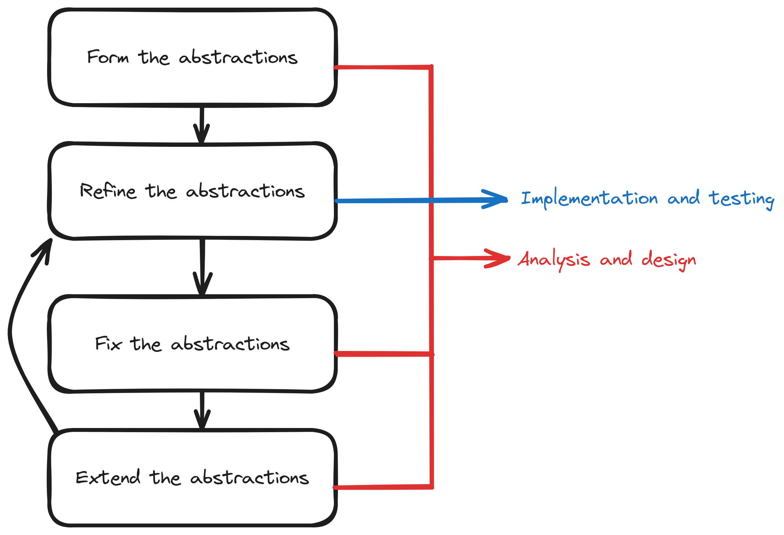

Development
###########

The nature of system specification
**********************************

System specification is an abstraction of how the system works (or should work).
System implementation is a refinement of such abstraction.
Abstracting the system in the form of specification documents helps developers focus on the core idea without getting
stuck in implementation details; however, such abstraction doesn't come without its risks.

Risks of abstraction
********************

The human brain can unintentionally fall into some pitfalls while thinking of abstractions:

Ambiguities
===========

#.  Developer states abstraction "a".
#.  Developer states abstraction "c" depending on abstraction "a" and an implicit abstraction "b".

The developer's brain wrongly assumed abstraction "b" has already been defined.

Contradictions
==============

#.  Developer states abstraction "a".
#.  Developer states abstraction "b" depending on an implicit contradiction of abstraction "a".

The developer's mind oversaw the contradiction.

Impossible-to-refine abstractions
=============================================

Developer states abstraction "a" which violates logic.

The developer's mind oversaw the violation.

Mitigating these problems with the iterative approach
*****************************************************

In the iterative approach, the system is built in iterations.
This helps in early implementation (refinement) and testing of the abstractions made by the developers.
Abstractions found incorrect in a certain iteration can then be fixed in a subsequent iteration.

  The iterative model as we see it.

Work Plan
*********

.. list-table:: Work Plan
  :header-rows: 1
  :widths: 50 6
  :class: table-bordered

  * - Task
    - Status
  * - Brainstorm ideas for the project
    - Done
  * - Analyze `Piston <piston-repo_>`_ and `Judge0 <judge0-repo_>`_
      (skim the source code and check their github issues)
    - Done
  * - Come up with an abstract idea of the project
    - Done
  * - Reanalyze `Piston <piston-repo_>`_ and `Judge0 <judge0-repo_>`_ to verify that the problem isn't already solved
    - Done
  * - Brainstorm the overview of the project
    - Done
  * - Write an initial guideline for collaborating on the project
    - Done
  * - Write an initial component diagram, sequence diagram, use-case diagram, api docs, object schema and activity flow
    - Done
  * - Come up with different technologies that can be used
    - Done
  * - Experiment with the different technologies to validate feasibility and to choose the most appropriate technologies
    - Done
  * - Update the documentation based on the new findings
    - Done
  * - Write a throwaway prototype for the most crucial parts of the system to check feasibility
    - Done
  * - Update the documentation based on the new findings
    - Done
  * - Write the initial pseudocode and class diagram
    - WIP
  * - Write an initial evolutionary functioning prototype
    - WIP
  * - Update the documentation based on findings from the prototype
    - WIP
  * - Refine the prototype until v0.0.1 is attained
    - WIP
  * - Write an initial user manual for the system
    - WIP
  * - Continuous evolution of the system
    - WIP

