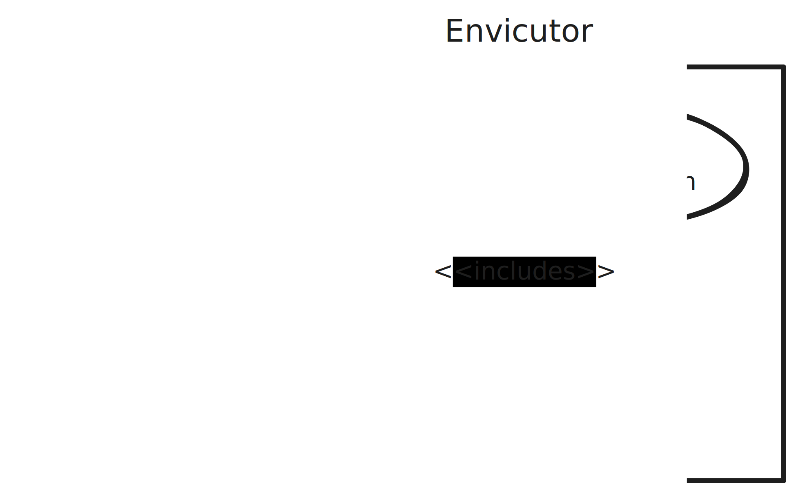

Use case diagram
################

Diagram
*******

  |product-name|'s use case diagram.

Explanation
***********

The client can create a submission which includes the code to be executed, the dependencies the code needs,
the run and compile instructions, and different :ref:`execution limits <execution_limits>`.
The client can get the status and the result of the submission.
The status is the current :ref:`stage <submission_status_request>` of the execution.
The result is the :term:`STDOUT`, :term:`STDERR`, signal and exit code of each stage.